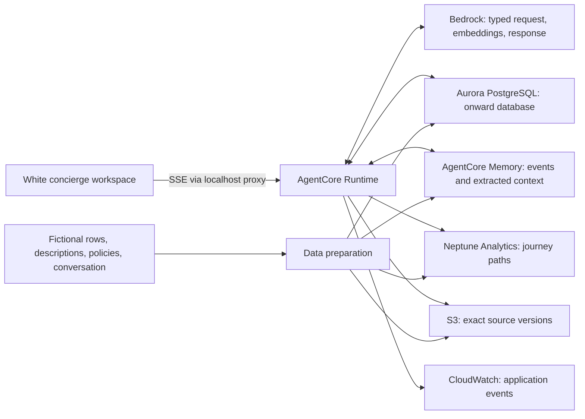

# Onward's semantic data and execution path

Onward is a locally served concierge UI backed by a deployed AWS agent. Application resources are in **us-east-1**, in Isengard account **619763002613**. The data is a bounded fictional travel fixture; every displayed live tool result is obtained from AWS.

## The contract spans the stores

The six components are responsibilities: Business context, Ontology, Disambiguation, Metrics, Relationships and Verified examples. Shared IDs, cost scope, currency, time zones, source versions and preference precedence bind their data together. Embeddings and a graph alone do not supply these definitions.

| Store/component | Authoritative responsibility | Deliberate boundary |
|---|---|---|
| Aurora `onward` on existing `meridian-demo` | Entities, definitions, current fictional offers/rooms, complete prices, descriptions and source references | Read-only runtime database role. Only the presenter's fixed stock action updates AX218. |
| PostgreSQL pgvector + full text | Titan 256D hotel embeddings plus lexical terms, combined using reciprocal rank fusion | Relevance influences eligible-hotel ordering. It cannot override budget, deadline, walking limit or inventory. |
| Neptune Analytics | Offer-to-leg, leg-to-airport, airport-to-venue transfer and hotel-to-venue walk relationships | Python computes elapsed time and validates the returned paths; the graph does not independently guarantee travel feasibility. |
| S3 | Versioned original policy/example documents and raw fixture | Runtime fetches versions named in Aurora. Policy passages are retrieved by ID/version in this demo, not by S3 Vectors. |
| AgentCore Memory | Recent conversation events plus extracted actor-scoped facts, preferences, summaries and episodes | Separate managed store. It is not backed by or mirrored into Aurora. Context is not authoritative fare or schedule data; current instructions override preferences. |
| Aurora PostgreSQL | Stable entities, explicit traveller declarations, product facts, hotel text and embeddings, complete-price definitions and current stock | The runtime uses remembered preference language to form the Bedrock embedding and lexical query executed by Aurora. Aurora stores the product/profile data and search indexes, not AgentCore Memory records. |
| Bedrock + AgentCore Runtime | Typed request interpretation, bounded tool orchestration and streamed explanation | Deterministic checks establish eligibility. Generated prose is grounded in the tool result and remains model output. |

## Preparation

`scripts/seed.py` loads `data/travel.json`. It creates Aurora tables and indexes, normalises entities and integer-pence cost lines, embeds hotel and document text, writes versioned S3 sources, builds Neptune edges, and stores the onboarding conversation in Memory. Built-in preference extraction runs asynchronously. Hotel query-expansion vocabulary and the reviewed complete-trip pattern are themselves stored definitions.

The source has five offers and three hotels: 15 complete candidate bundles. The entire small candidate set is checked for hard constraints, so vector top-k retrieval does not hide the only feasible option. The demo demonstrates the architecture, not large-scale retrieval performance. Document embeddings are seeded for future retrieval work; current policy reads follow explicit version references.

## One deployed request

1. The Node proxy validates the local request and AWS account, then invokes the IAM-authenticated runtime. The browser never receives credentials.
2. Runtime reads definitions from Aurora and previous conversation events from Memory. Bedrock emits one typed `resolve_trip_request` tool call, validated with Pydantic.
3. Aurora resolves aliases into shared entity IDs. Unsupported route/date/night requests return a clear limitation without substituting another trip.
4. Memory returns long-term preferences, or labelled onboarding source context if extraction is not ready. Titan embeds the context-expanded query. Aurora combines vector and lexical rankings.
5. Parameterised Aurora SQL calculates complete bundle prices. Neptune openCypher returns flight paths, transfers and hotel walks. S3 returns the referenced source versions.
6. Python validates airport continuity, offset-aware connection elapsed time, venue deadline and walks. A fresh Aurora query rechecks prices and availability; hard constraints apply before ranking.
7. Runtime emits the validated plan, streams Bedrock's explanation and stores the conversation plus typed contract in Memory.

`backend/services.py` owns bounded SQL/openCypher and SDK calls. `backend/planner.py` owns deterministic feasibility and ordering. `backend/main.py` owns orchestration, typed interpretation and the event stream. Neither the model nor the browser can submit arbitrary SQL to the runtime.

## Streaming and observability

The SSE stream contains run lifecycle, 24 semantic events (four per component), a validated plan, answer tokens, model usage, answer persistence evidence and completion/error events. Each semantic event has an ID, timestamp and explicit service responsibility; completed tool calls carry real request IDs and measured elapsed time.

The browser buffers this stream. Pause and step affect disclosure, not AWS execution. Replay consumes the recorded queue without invoking AWS. The proxy saves received SSE runs under `.local/runs/`, which is excluded from static serving. The UI's current replay is in-memory, not a browsable archive of previous server runs.

CloudWatch receives structured application events in a KMS-encrypted runtime log group with seven-day retention. Full ADOT/X-Ray span export is not configured. The visible panel is application tool evidence, not a transcript of private model reasoning or a claim of native model reasoning telemetry.

## Memory semantics

The fictional actor is `alex-onward`, with long-term namespace `/onward/actors/{actorId}/preferences/`. New conversations get new runtime sessions. They retain actor preferences while resetting the conversation contract. Memory off removes the ranking contribution; it does not delete past events. Asking to remember a preference stores conversation evidence immediately; asynchronous extraction may become available later.

This is a single-traveller local demo. External multi-user hosting would require authenticated actor mapping, access control and separate session ownership.

## Choosing the architecture

| Need | Suitable starting point | When to add a specialist |
|---|---|---|
| Current prices, joins, strict arithmetic, transactional facts | Aurora PostgreSQL | Add DynamoDB for a separate high-volume key-value or idempotent operational workload, if one exists. |
| Text meaning plus structured filters | Aurora pgvector + PostgreSQL full text | Add S3 Vectors for a distinct large document corpus and suitable retrieval/access pattern. It is not needed for three hotels. |
| Connected paths and relationship questions | Relational tables and bounded joins for simple paths | Neptune becomes useful when relationship traversal is central or evolves beyond manageable joins. This demo deliberately makes that role visible. |
| Prior user context | AgentCore Memory | Use clear identity, precedence and retention; never move current business facts into memory merely for convenience. |
| Memory-to-product integration | AgentCore Runtime → Bedrock → Aurora PostgreSQL | Retrieve actor-scoped preferences, resolve them against the current request and Aurora profile, create the query embedding, then run Aurora full-text/pgvector retrieval. The stores do not call or replicate into one another. |
| Reproducible source evidence | Versioned S3 objects plus source IDs | Add document retrieval when the corpus needs discovery rather than a known policy reference. |

S3 Vectors and DynamoDB are not provisioned. There are no live travel-provider integrations, reservations, payment actions or production traffic-time estimates. Exact deployed IDs and operational guidance are in [infra/README.md](infra/README.md).
